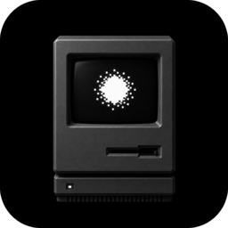
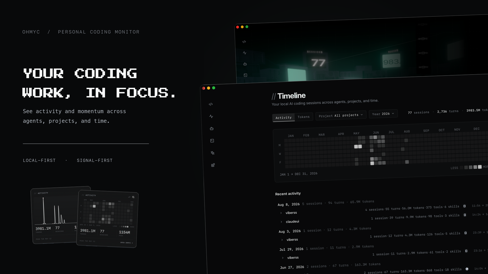

<p align="center">
  <a href="https://github.com/JiangWeixian/ohmyc/releases/latest">
    
  </a>
</p>

# OhMyC

[](https://github.com/JiangWeixian/ohmyc/releases)
[](https://github.com/JiangWeixian/ohmyc/actions/workflows/ci.yml)

[English](README.md)

OhMyC 让你看见自己的 AI 编程工具都干了些什么。Claude Code、Codex、OpenCode 各记
各的，OhMyC 把它们放进同一个窗口：跑了什么、什么时候跑的、花了多少 token、时间
都花在哪些项目上，顺带列出本机装的 agents、skills、commands、plugins。数据不出
你的电脑。

<p align="center">
  <a href="https://github.com/JiangWeixian/ohmyc/releases/latest">
    
  </a>
</p>

## 上手

三步，装完之后你跑的下一次会话就会出现在应用里。

### 1. 下载安装

去 [Releases 页面](https://github.com/JiangWeixian/ohmyc/releases/latest) 下最新
的包，装好，打开 **OhMyC**。

### 2. 给你的 agent 装插件

刚打开会停在 **Monitor not connected**，因为还没有东西在记录你的会话——干这活的
是插件。装你在用的那个：

**Claude Code**

```text
/plugin marketplace add JiangWeixian/ohmyc-plugins
/plugin install timeline@ohmyc
```

**Codex**

```bash
codex plugin marketplace add JiangWeixian/ohmyc-plugins
```

然后运行 `codex`，打开 `/plugins`，从 `ohmyc` 市场里装 **OhMyC Timeline**。

**OpenCode** —— 把包名加进 `opencode.json`：

```json
{
  "$schema": "https://opencode.ai/config.json",
  "plugin": ["@ohmyc/timeline-plugin"]
}
```

详细说明、依赖和配置项都在
[ohmyc-plugins](https://github.com/JiangWeixian/ohmyc-plugins)。

### 3. 点 Check again

回到 OhMyC 点一下，界面就切过去了。之后你的会话会自己进 Monitor 和 Timeline，
不用再管。

还是什么都没有？看下面的[看着不对劲的时候](#看着不对劲的时候)。

## 各个界面

| 界面 | 用来干嘛 |
| --- | --- |
| **Monitor** | 一眼看最近在忙什么，打开就是这页 |
| **Timeline** | 按天、按项目往下翻到单个会话和回合 |
| **Explorer** | 本机的 agents、skills、commands、plugins |
| **菜单栏**（Mac） | 不开窗口也能看热力图和图表 |

按 **⌘K** 换主题（Monitor、Phosphor Mono、Amber CRT、Retro Wave、Cyberpunk），
以及 calm / expressive 两档强度。跳转快捷键：`g m` Monitor、`g t` Timeline、
`g a` Agents、`g s` Skills、`g c` Commands。

## 你的数据

OhMyC 收集的东西都放在本机的 `~/.config/ohmyc/`。不需要账号，不上传，不同步。
删掉那个目录就什么都不剩。文件想放别处，设个 `OHMYC_HOME` 指过去。

<details>
<summary>Explorer 会去翻哪些目录</summary>

| 来源 | 路径 |
| --- | --- |
| Claude | `~/.claude/`、项目 `.claude/` |
| Codex | `~/.codex/`、项目 `.codex/` |
| OpenCode | `~/.config/opencode/`（Mac 上也可能在 Application Support）、项目 `.opencode/` |
| 共享 skills | `~/.agents/skills/`、项目 `.agents/skills/` |

`.agents` 下的 skill 可能同时属于多个工具，所以会带好几个来源标记（比如 codex
和 opencode）。

</details>

## 看着不对劲的时候

| 你看到的 | 怎么办 |
| --- | --- |
| Monitor not connected | 把第 2 步做完，再点一次 **Check again** |
| Timeline 是空的 | 插件是在会话结束时记录的，装完之后得再跑一次会话 |
| Explorer 是空的 | 确认上面那些目录在，再把 source 过滤清掉 |

还是不行就去提
[issue](https://github.com/JiangWeixian/ohmyc/issues)，说清楚你用的哪个 agent、
做了什么、看到了什么。

---

Built with love =^._.^=
